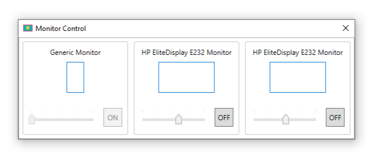

# Monitor Control

Control brightness of connected monitors and also switch them on/off, specially designed for Laptop based setup with Windows 10.

## Features
- Change brightness setting per monitor
- Power on/off each monitor
- Show monitors orientation 
- Show monitors using the horizontal position in the setup

## Instalation

Requires Microsoft .NET Core Runtime 3.0, download from 
https://dotnet.microsoft.com/download/dotnet-core/3.0/runtime

**Note**: Some Laptop screen and external monitors are not supported.

## TODO List:
- Identify monitors with a number on the screen
- Change brightness in sync with main display using windows control or prefined keys 

## Licence

Copyright ©2019 Ricardo Tejo

MIT License:

Permission is hereby granted, free of charge, to any person obtaining a copy of this software and associated documentation files (the "Software"), to deal in the Software without restriction, including without limitation the rights to use, copy, modify, merge, publish, distribute, sublicense, and/or sell copies of the Software, and to permit persons to whom the Software is furnished to do so, subject to the following conditions:

The above copyright notice and this permission notice shall be included in all copies or substantial portions of the Software.

THE SOFTWARE IS PROVIDED "AS IS", WITHOUT WARRANTY OF ANY KIND, EXPRESS OR IMPLIED, INCLUDING BUT NOT LIMITED TO THE WARRANTIES OF MERCHANTABILITY, FITNESS FOR A PARTICULAR PURPOSE AND NONINFRINGEMENT. IN NO EVENT SHALL THE AUTHORS OR COPYRIGHT HOLDERS BE LIABLE FOR ANY CLAIM, DAMAGES OR OTHER LIABILITY, WHETHER IN AN ACTION OF CONTRACT, TORT OR OTHERWISE, ARISING FROM, OUT OF OR IN CONNECTION WITH THE SOFTWARE OR THE USE OR OTHER DEALINGS IN THE SOFTWARE.

*Icon derived from an Icon made by [Freepik](https://www.flaticon.com/authors/freepik) from [Flaticon](https://www.flaticon.com/)*
